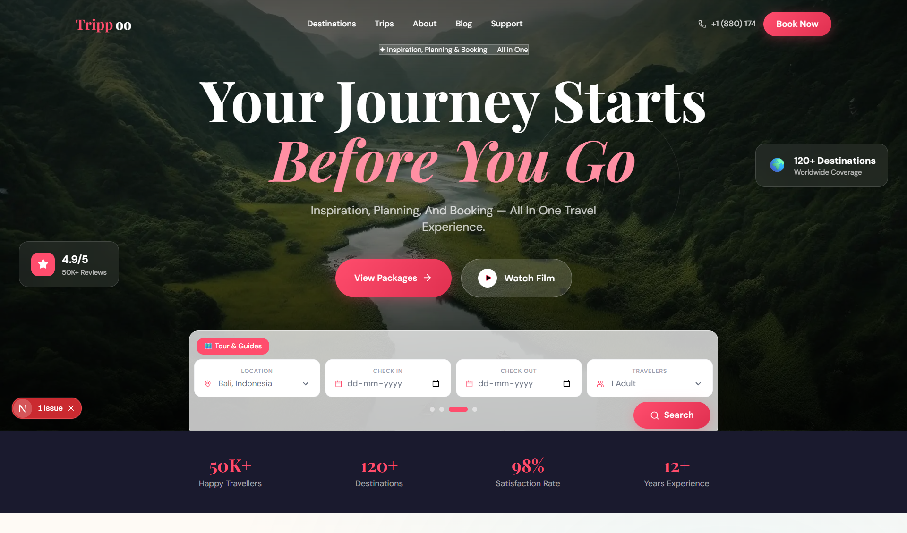

# ✈️ Trippo Luxury Travel

A premium modern travel booking website built with Next.js, Tailwind CSS, and Framer Motion.

## 📸 Screenshots

### 🏠 Home Page

<p align="center">
  
</p>

---

## 🌍 Features

- Premium Hero Carousel
- Luxury Travel UI
- Responsive Mobile Design
- Floating CTA Buttons
- Interactive Search Bar
- Smooth Animations
- SEO Friendly Structure
- Glassmorphism Effects
- Modern Booking Experience

---

## 🚀 Tech Stack

- Next.js 16
- React.js
- Tailwind CSS
- Framer Motion
- Lucide React Icons

---

## 📱 Responsive Design

Optimized for:

- Mobile
- Tablet
- Desktop
- iPhone UI Experience

---

## ⚡ Installation

```bash
git clone https://github.com/yourusername/Trippo-luxury-travel.git
```

```bash
cd Trippo-luxury-travel
```

```bash
npm install
```

```bash
npm run dev
```

---

## 🛠 Folder Structure

```bash
app/
components/
public/
styles/
```

---

## ✨ UI Highlights

- Floating Action Buttons
- Animated Hero Section
- Luxury Travel Cards
- Smooth Motion Effects
- Modern Search Experience

---

## 🌐 Future Enhancements

- AI Trip Planner
- Booking System
- Authentication
- Payment Gateway
- Travel Dashboard
- Wishlist System

---

## 📄 License

MIT License

---

## 💙 Developed By

Meganathan